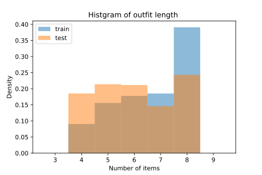

# Maryland Polyvore

## Introduction

The [Maryland Polyvore Dataset](https://github.com/xthan/polyvore-dataset) contains 111,589 unique items and 21,889 outfits. The number of fine-grained categories is 380. There are 17,316 outfits for training, 1,497 for validation and 3,076 for test. Fashion items are used 142,480 times and average reuse rate is 1.28. The averaged number of items in an outfit is 6.51 and the histgram is shown as follows:



## Original data format

Fashion outfits are saved in three splits:

- train split: “label/train_no_dup.json”
- valid split: “label/valid_no_dup.json”
- test split: “label/test_no_dup.json”

The `json` file contains list of outfits and each outfit has the following keys:

```yaml
['name', 'views', 'items', 'image', 'likes', 'date', 'set_url', 'set_id', 'desc']
```
where `items` is a list of dictonaries, each of which has the following keys:

```yaml
['index', 'name', 'prices', 'likes', 'image', 'categoryid']
```

