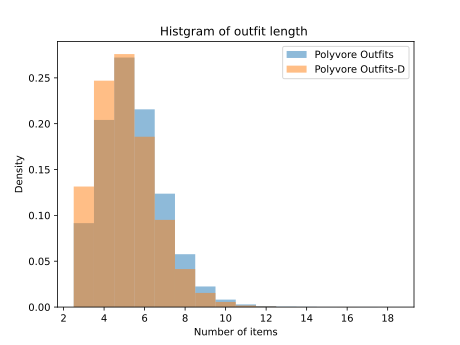

# Polyvore Outfits

The Polyvore Outfits datasets contain two different splits:

- Polyvore Outfits: outifts are partically ovelapped between training and test set.
- Polyvore Outfits-D: outfits are not overlapped between training and test set.

The statistics of the Polyvore Outfits datasets are as follows:

|      Dataset       | #Items  | #Outfits | #Train | #Valid | #Test  | Max length |
| :----------------: | :-----: | :------: | :----: | :----: | :----: | :--------: |
|  Polyvore Outfits  | 251,008 |  68,306  | 53,306 | 5,000  | 10,000 |     19     |
| Polyvore Outfits-D | 152,785 |  35,140  | 16,995 | 3,000  | 15,145 |     16     |

This dataset contains 11 fashion categories which are:

```python
[
    'accessories', 'all-body', 'bags', 'bottoms',
    'hats', 'jewellery', 'outerwear', 'scarves',
    'shoes', 'sunglasses', 'tops'
]
```


